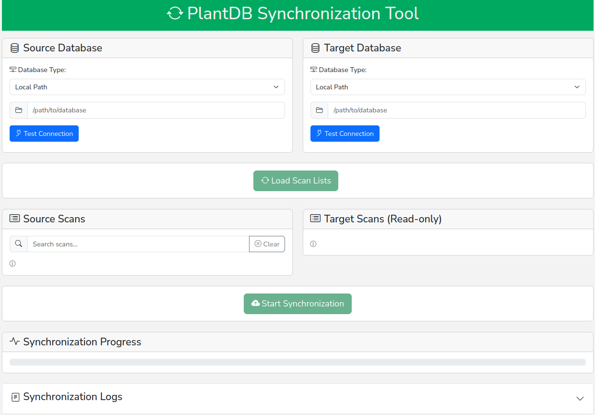

# PlantDB Synchronization Tool

## Overview

The PlantDB Synchronization Tool is a web-based application that allows users to synchronize databases between different sources.
It provides an intuitive interface for managing database synchronization across various connection types.



## Features

- Support for multiple database connection types:
  - Local filesystem
  - SSH/SFTP remote connections
  - HTTP REST API
- Real-time synchronization progress tracking
- Search functionality for scan filtering
- Detailed synchronization logs
- User-friendly interface with intuitive controls

## Getting Started

### Launching the Application
Call the entrypoint:
```shell
sync_app
```

You amy also run the synchronization tool using Python:
```shell
python -m plantdb.client.sync_app
```
The default port is 8050.

You can specify a different port using the `--port` argument:
```shell
python -m plantdb.client.sync_app --port 8051
```

For a complete list of options, call `sync_app -h`.

### Usage Steps

1. **Configure Source Database**
    - Select the database type (Local Path, SSH/SFTP, or HTTP REST API)
    - Fill in the required connection details:
        - For Local Path: Enter the filesystem path
        - For SSH/SFTP: Provide hostname, path, username, and password
        - For HTTP REST API: Enter the API URL
    - Click "Test Connection" to verify the connection

2. **Configure Target Database**
    - Follow the same steps as the source database configuration
    - The target database will store synchronized data

3. **Load Scan Lists**
    - After configuring both databases, click "Load Scan Lists"
    - The tool will display available scans from both databases
    - Scans already present in the target database will be disabled (shown in gray)

4. **Select Scans to Synchronize**
    - Use the search box to filter source scans by names
    - Select the scans you want to synchronize using the checkboxes
    - The target scans list is read-only and shows existing scans

5. **Start Synchronization**
    - Click "Start Synchronization" to begin the process
    - Monitor progress through the progress bar
    - View detailed logs in the expandable "Synchronization Logs" section

## Tips
- Always test connections before attempting synchronization
- Use the search functionality to easily find specific scans
- Monitor the synchronization logs for detailed progress information
- The tool prevents synchronizing scans that already exist in the target database
- The interface provides visual feedback about connection status and synchronization progress

## Support
For issues or questions about the PlantDB Synchronization Tool, please refer to the project documentation or contact your system administrator.
